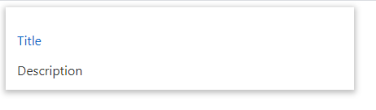

### docure-article-card

```js
npm i @specialdoom/docure-article-card

```
### usage

```html
<docure-article-card>
  <span slot="title">Title</span>
  <span slot="description">Description</span>
</docure-article-card>
```

### slots
- _slot="title"_ to display the title of the article
- _slot="description"_ to display the description of the article

You can use any of the html elements instead of _span_ element, but you need to add the slot attribute depending on what you want to display.

### example 

